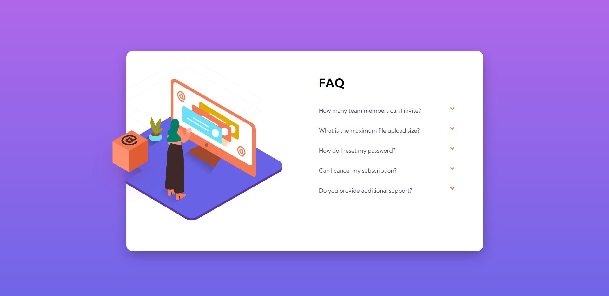

 <h3>Frontend Mentor - FAQ Accordion Card Challenge</h3>
 

 

 This is my solution to <strong>FAQ Accordion Card </strong> challenge by frontendmentor.io.  
 Frontend mentor helps in improving your coding skills by building realistic projects.

 

 <h3>Screenshot</h3>
 
 
 

 <h3>Live URL link -</h3> 
 <a href="https://catherineisonline.github.io/faq-accordion-card-frontendmentor/">Click here</a>
 

 <h3>My Process</h3>
 
 Started with writing down the markup in HTML. Then using CSS custom properties designed desktop view for the given problem. Later with the help of Chrome Dev Tools it was made responsive for every aspect ratio. 
 Also Javascript was used for making it interactive on user click.
 
 

 <h3>Built Using</h3>
 <ul>
 <li>HTML5 Markup Language</li>
 <li>CSS Custom Properties</li>
 <li>Javascript DOM properties</li>
 </ul>
